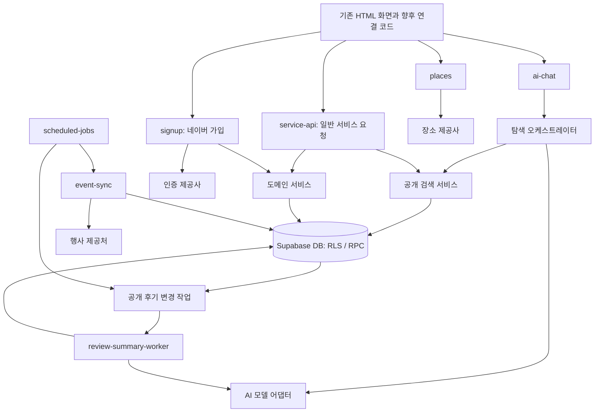

# 유미당 백엔드·AI 에이전트 상세 구조 설계

기준일:2026-10-05. [정책](정책.md)·[계획](PLAN.md)·[IA](docs/planning/design/IA.md)·[USERFLOW](docs/planning/design/USERFLOW.md)의 현재 기준을 적용한다. 사용자 확정96개·후속20개·추가3개와 기존 충돌 없는 기술 경계를 반영한다. 이 문서는 실제 코드·DB·화면·외부 연결의 완료 보고가 아니다. 최신 정책에 대한 제품 검증은 NOT_RUN이며 별도 결과가 필요하다.

아래 API명·데이터 구조는 기존 계약과 대조할 설계다. 기존 모듈은 같은 위치에서 보완하며 중복 폴더를 만들지 않는다. 문서 전체 동기화 예외는 코드·SQL·소유권·hook·운영 배포로 확대하지 않는다.

## 1. 설계 대상과 책임

| 영역 | 책임 | 대표 결과물 |
|---|---|---|
| 화면 연결 규약 | 화면이 보내는 입력과 표시할 결과를 정의 | API 계약, 오류 코드, 화면 상태 |
| 백엔드 진입점 | 요청 검증, 호출자 확인, 기능별 처리 연결 | Edge Function의 handler |
| 도메인 서비스 | 가입·공고·매칭 등 기능의 처리 순서 | services 내부 모듈 |
| DB | 접근 권한, 상태 전이, 동시 처리, 중복 방지 | 테이블, RLS, 트랜잭션 RPC |
| 외부 연동 | 업체별 요청·응답을 내부 형식으로 변환 | 인증·장소·행사 어댑터 |
| AI 탐색 | 자연어 조건 해석, 질문, 검색 결과 설명 | 탐색 챗봇 |
| AI 리뷰 요약 | 공개 후기 원문을 근거로 요약 생성 | 비동기 요약 워커 |
| 작업 실행 | 변경 이벤트와 예약 작업의 처리·재시도 | 작업 테이블, 실행기 |

AI 에이전트는 유미당 이용자에게 기능을 제공하는 서비스 구성 요소다. 개발 작업을 수행하는 에이전트 팀과는 별개다. 초기 서비스는 **탐색 챗봇 1개와 리뷰 요약 파이프라인 1개**로 구성하는 안을 제안한다. 검색·검증·저장을 각각 독립적인 AI 에이전트로 만들 필요는 없다.



화살표는 논리적 처리 관계다. 자동 완료의 건별 DB 영속 예약·Node 상주 실행기 방향과 일일 00:01 작업 등록은 확정이며, 실제 운영 연결·호스트·확정 한도의 지원 여부는 별도 검증한다.

## 2. 목표 폴더·파일 구조

아래는 기존 파일의 기능 경계다. 모든 파일이 골격이거나 전체 기능이 완료됐다는 뜻이 아니다. [백엔드 안내](backend/README.md)와 [종현 연결 계획](260929_종현담당_PLAN.md)을 읽고 기존 위치에서 필요한 부분을 보완한다. 네이버·무료·새 검색/후기/행사 기준의 실제 적용은 별도 확인한다.

AI 실제 작성 위치는 [AI 폴더 안내](backend/supabase/functions/_shared/ai/Agents/README.md)의 `_shared/ai/Agents/chatbot/`·`_shared/ai/Agents/review-summary/`, 모델 연결은 `_shared/ai/providers/`다. 문서 동기화를 이유로 이동·중복 구현하지 않는다.

```text
backend/
├── README.md                           # 실행 방법, 경계, 문서 위치
├── contracts/                          # 프론트·백엔드 담당자 간 합의 문서
│   ├── conventions.md                  # 인증, 날짜, 페이지 처리, 오류 규칙
│   ├── signup.md                       # 가입·로그인·프로필 완료 상태
│   ├── verification.md                 # 추후 이메일·유료 계좌 인증 경계
│   ├── posts-search.md                 # 민규: 공고 작성·수정·조회, 검색 연결 경계
│   ├── search.md                       # 종현 단독 편집: 공개 검색 계약
│   ├── matching.md                     # 신청·상대 선택·최종 동의
│   ├── reviews.md                      # 평가 작성·공개·칭찬 집계
│   ├── ai-chat.md                      # 탐색 대화 입력·검색 카드·실패 응답
│   └── review-summary.md               # 요약 노출 조건·상태·갱신
└── supabase/
    ├── config.toml                     # 새 로컬 환경 설정
    ├── migrations/                     # 기존 이력 보존, 변경은 후속 SQL
    ├── seeds/                          # 실제 개인정보 없는 새 가상 데이터
    └── functions/
        ├── deno.json                   # 공통 의존성·검사 명령 제안
        ├── service-api/                # 공고·신청·매칭·평가·알림 HTTP 진입점
        │   ├── index.ts                # 런타임 시작과 의존성 구성
        │   ├── handler.ts              # HTTP 요청→응답
        │   └── routes.ts               # 기능별 서비스로 연결
        ├── signup/                     # index.ts + handler.ts
        ├── verification/               # index.ts + handler.ts
        ├── places/                     # index.ts + handler.ts
        ├── event-sync/                 # 내부 전용 행사 수집
        ├── ai-chat/                    # 탐색 대화 요청 진입점
        ├── review-summary-worker/      # 내부 전용 요약 작업 실행
        ├── scheduled-jobs/             # 내부 전용 시간 기반 작업 등록·실행
        └── _shared/
            ├── config/
            │   └── env.ts              # 필수 설정 검증, 환경 구분
            ├── http/
            │   ├── request.ts          # 요청 크기·형식·requestId
            │   ├── response.ts         # 공통 성공·오류 응답
            │   ├── errors.ts           # 내부 오류→공개 오류 코드
            │   └── cors.ts             # 허용 출처 설정
            ├── contracts/              # 실제 런타임 검증·타입
            │   ├── common.ts
            │   ├── signup.ts
            │   ├── verification.ts
            │   ├── posts.ts
            │   ├── matching.ts
            │   ├── reviews.ts
            │   ├── search.ts
            │   └── ai.ts
            ├── auth/
            │   ├── principal.ts        # 검증된 호출자 문맥
            │   ├── eligibility.ts      # 가입 근거·프로필 완료 상태 해석
            │   ├── internal-caller.ts  # 예약 작업·워커 호출자 확인
            │   └── session-bridge.ts   # 네이버 계정과 서비스 세션 연결 경계
            ├── services/
            │   ├── signup-service.ts
            │   ├── verification-service.ts
            │   ├── profile-service.ts
            │   ├── post-service.ts
            │   ├── search-service.ts   # 일반 검색과 AI 검색의 공통 경로
            │   ├── matching-service.ts
            │   ├── conversation-service.ts
            │   ├── completion-service.ts
            │   ├── review-service.ts
            │   ├── notification-service.ts
            │   └── event-service.ts
            ├── db/
            │   ├── user-client.ts      # 사용자 권한을 전달하는 DB 접근
            │   ├── internal-client.ts  # 서버 작업용 제한된 접근 경계
            │   └── repositories/      # 기능별 조회·RPC 호출·결과 변환
            ├── integrations/
            │   ├── identity/           # 기존 인증 경계: 네이버 정책과 적합성 후속 확인
            │   ├── phone/              # 기존 코드 보존; 현재 로그인 연결 대상 아님
            │   ├── email/              # 추후 선택 이메일 인증 검토
            │   ├── bank/               # 추후 유료 신청·제안 1원 인증
            │   ├── places/             # 카카오 장소 검색·우편번호 주소 선택 연결
            │   └── events/             # 행사 제공처별 수집·표준화
            ├── ai/
            │   ├── Agents/             # AI 에이전트별 구현 파일
            │   │   ├── chatbot/        # 6장: 탐색 에이전트
            │   │   └── review-summary/ # 7장: 리뷰 요약 에이전트
            │   └── providers/          # 두 에이전트가 사용하는 모델 연결
            ├── jobs/
            │   ├── registry.ts         # 허용 작업 유형·실행기 연결
            │   ├── enqueue.ts          # 중복 방지 키로 작업 등록
            │   ├── lease.ts            # 점유·만료·재점유
            │   └── retry.ts            # 재시도 가능 오류·실행 시각
            └── observability/
                ├── logger.ts          # 민감정보 없는 구조화 로그
                ├── metrics.ts         # 성공률·처리 시간·사용량
                └── redaction.ts       # 금지 필드 제거

tests/
├── database/                           # RLS, RPC, 제약, 경쟁 상태
├── functions/                          # 인증·입력·오류 응답
├── contracts/                          # 화면 계약과 실제 응답 일치
├── integration/                        # 여러 사용자 간 처리
├── ai/                                 # 탐색·요약 평가와 공격성 입력
└── fixtures/                           # 가상 사용자·공고·후기·행사

tools/local/                            # 새 환경 점검·실행·검증 명령
```

`backend/contracts/`는 사람이 합의하는 문서이고 `_shared/contracts/`는 실행 시 입력·출력을 검사하는 코드다. 둘의 역할을 구분하되 필드·오류의 실제 대응을 확인한다. 기존 검증 자료는 보존하고 정책 영향에 맞는 사례만 갱신한다.

폴더만 표시한 영역에도 구현 위치를 구체화했다. 함수 진입점의 `index.ts`·`handler.ts`와 `repositories/`의 profiles·verifications·posts·matching·conversations·completion·reviews·notifications·search·events·review-summaries·jobs 경계를 재사용한다. 각 외부 연동 폴더의 `port.ts`·`adapter.ts`, 행사 연동의 `normalize.ts` 경계를 확인한다. AI 파일은 6·7장의 목록을 기준으로 확인한다. 이는 인터페이스·정책 확정이나 실제 연동 완료를 의미하지 않는다.

`_shared`를 통한 공통 코드 구성은 [Supabase Edge Functions 구조 안내](https://supabase.com/docs/guides/functions/development-tips)를 참고했다. 위의 구체적인 파일 분할과 `service-api` 추가는 유미당에 대한 제안이다.

## 3. 모듈 의존성과 공통 처리

기본 의존 방향은 `handler → service → repository / integration`이다. AI 오케스트레이터는 허용된 도구를 통해 `search-service`를 호출한다.

| 모듈 | 담당 | 맡기지 않는 일 |
|---|---|---|
| index | 런타임과 설정 연결 | 업무 규칙 |
| handler / routes | 인증·입력 검증·응답 변환 | SQL 작성, 프롬프트 구성 |
| service | 기능의 처리 순서와 외부 연동 조합 | HTTP 상태 코드 직접 결정 |
| repository | DB 조회·RPC 호출, 데이터 형식 변환 | AI 모델 호출 |
| DB RPC | 권한·최신 상태를 확인하고 원자적으로 변경 | 외부 API 성공을 가정한 장시간 대기 |
| integration | 업체별 형식·서명·오류 변환 | 회원 자격·매칭 결정 |
| AI provider | 모델 요청·구조화 응답·사용량 변환 | DB 조회·계정 권한 부여 |

양쪽 동의·회원 자격·중복 방지·현재 무료 범위는 서버와 DB 변경 경계에서 재확인한다. DB 직접 호출로 우회하지 못해야 한다. 추후 유료에서 무효 계좌의 배지를 숨기는 기준은 유지한다. 효력 변경 이후 확정 허용·재인증·상대 안내는 팀 검토이며 지금 활성화하거나 임의 차단 규칙을 만들지 않는다.

사용자 요청은 검증된 사용자 문맥을 DB까지 전달한다. 내부 권한 클라이언트는 예약 작업·외부 인증 결과 기록 등 제한된 경로에서만 사용한다. AI에는 클라이언트·키·임의 SQL 실행 도구를 제공하지 않는다. RLS는 행 접근을 제어하므로 공개 필드 분리와 반환 필드 제한도 별도로 설계한다. 권한 우회가 가능한 서버 키의 특성은 [Supabase RLS 안내](https://supabase.com/docs/guides/database/postgres/row-level-security)를 기준으로 검증한다.

공통 성공 응답은 `{ data, requestId }`, 오류 응답은 `{ error: { code, message, retryable }, requestId }` 형태를 제안한다. 오류 원문·SQL·외부 인증 응답·토큰은 사용자 응답에 넣지 않는다.

주요 오류 예시는 `AUTH_REQUIRED`, `PROFILE_INCOMPLETE`, `VERIFICATION_REQUIRED`, `CONDITION_CHANGED`, `STATE_CONFLICT`, `RATE_LIMITED`, `EXTERNAL_UNAVAILABLE`다. 세부 코드와 HTTP 상태는 계약 문서에서 확정한다. 존재 여부를 숨겨야 하는 리소스는 응답 차이로 타인의 정보를 추측할 수 없도록 처리한다.

## 4. 기능 계약과 상태 전이

서버·DB 변경 경계에서 관계 권한·현재 상태·조건 버전·만료·중복을 재검사한다. 아래는 현재 정책이며 API 경로·필드 매핑은 [서비스 계약](backend/contracts/service-api.md)과 대조한다. 시각은 서버 접수 기준이고 마감보다 빠를 때만 수락한다. 재신청의1분은 최소 대기 조건이다.

### 2. 가입·로그인·계정

#### 2-1. 로그인과 가입 자격

- 초기 로그인 수단은 네이버 간편 로그인만 제공한다. 다른 수단은 추후 검토한다.
- 가입 자격은 네이버 인증정보만으로 확인하며 별도 휴대폰 본인인증은 추가하지 않는다.
- 네이버에서 이름·성별·생일·출생연도를 받아 여성·만 19세 이상 여부를 확인한다.
- 필수 정보가 누락되거나 확인할 수 없으면 가입을 보류하고 네이버 정보 확인과 재시도를 안내한다.
- 만 19세 미만 또는 대상 자격을 충족하지 않으면 가입할 수 없다.
- 네이버 계정 하나에는 유미당 계정 하나를 연결한다.
- 신규 회원은 S05 로그인·자격 확인 후 S06 가입 프로필로 이동한다.
- 기존 회원은 로그인 전 시도했던 목적 화면으로 복귀하고, 복귀 대상이 없으면 홈으로 이동한다.

#### 2-2. 가입 프로필

- 프로필 사진은 필수다. 사진 선택만으로 가입이 완료되지 않으며 `가입 완료`를 눌러야 한다.
- 사진 형식은 JPG·JPEG·PNG, 원본 크기는 10MB 이하로 안내한다.
- 관심사와 대화 방식은 선택이며 기본 선택지와 직접 입력을 지원한다.
- 관심사·대화 방식은 각각 최대 20개, 항목당 40자까지로 표현한다.
- MBTI는 E/I, S/N, T/F, J/P 네 쌍으로 선택하며 비워둘 수 있다.
- 가입 완료 후 안내 팝업을 확인하면 S00 홈으로 이동한다. 별도 가입 완료 화면은 만들지 않는다.

#### 2-3. 계정 상태와 탈퇴

- S21에서 네이버 본인·성인 확인 상태, 실명과 마스킹 이름, 성별·나이, 가입일, 제재 내역을 확인한다.
- 계정 상태는 정상, 경고, 이용 정지로 구분한다.
- 확정된 동행을 연속 3번 취소한 사용자에게 첫 경고를 적용한다.
- 취소·완료 결과 확정 직전 양쪽이 합의한 최신 예정 시작 시각 순서로 결과를 집계한다. 시작 시각이 같으면 동행 확정 시각이 빠른 순서, 그것도 같으면 내부 고유번호 순서로 고정한다. 중간 동행의 결과가 미정이면 그 뒤 연속 판정을 보류한다. 취소 버튼을 누른 순서로 제재를 판정하지 않는다.
- 정상 완료하면 연속 취소 횟수를 0으로 초기화한다. 확정 전 철회와 상대방 취소는 본인의 취소 횟수에 포함하지 않는다.
- 첫 경고와 각 제재마다 횟수만 0으로 초기화한다. 정상 완료·탈퇴·재가입으로 경고 이력은 지우지 않는다. 첫 경고 이후 다시 연속 3번 취소할 때마다 7일 제한을 적용한다.
- 7일 동안 신규 공고 작성·신규 신청·재신청·새 확정 요청·수락을 제한한다. 기존 확정 약속 관리·기존 채팅·후기는 허용한다. 복원된 신청에도 새 확정 요청·수락 제한을 적용한다.
- 취소 사유 이의 신청은 취소 처리 후 24시간 이내 접수한다. 취소 횟수는 우선 반영하되 이의 신청 기한 종료까지 해당 취소에 근거한 경고·제재 적용을 보류한다.
- 기한 내 이의 신청이 없으면 기한 종료 후 적용 가능한 경고·제재를 판정한다. 신청이 있으면 운영 검토 종료 후 판정하며 인정된 예외 사유는 제외한다. 예정 시작 시각 순서의 중간 결과가 미정이면 연속 판정 보류도 유지한다.
- 7일 기능 제한은 실제 제재 적용 시각부터 계산한다. 이의 신청 대기·검토 기간을 제재 기간에 포함하지 않는다. 예외 인정 결과는 예정 시작 시각 순서의 집계에 반영한다.
- 취소 제재가 겹치면 각각 실제 적용 시각부터 7일로 계산하고 가장 늦은 종료 시각까지 유지한다. 기간을 단순 합산하지 않는다.
- 예외·오판 정정은 원래 집계 순서로 재계산한다. 잘못된 경고·남은 제한을 즉시 취소하고 정정 이유와 바뀐 상태를 알린다.
- S21에서 사유·이의 마감·검토 상태·실제 제한 종료를 보여주며 대기·적용·해제 상태 변경을 알린다.
- 탈퇴 시 작성 공고와 진행 중 신청을 취소한다.
- 진행 중인 확정 약속이 있으면 탈퇴할 수 없다. 후기 작성 기간만 남거나 진행 확정 약속 없이 분쟁만 남았다면 탈퇴할 수 있고 분쟁 처리는 별도로 유지한다.
- 일반·경고·제재 중 모두 재가입을 즉시 허용한다. 기간제 제재는 원래 종료 시각까지 동일 기능 제한을 승계한다. 영구 이용 제한은 종료 시각 없이 승계하며 재가입이 활동 재개를 뜻하지 않는다. 재가입으로 제재 기간을 초기화하거나 연장하지 않는다.
- 동일 네이버 계정의 검증된 식별값으로 제재·경고 이력과 연속 취소 기록을 연결한다. 이름·생일만으로 다른 네이버 계정을 동일인이라고 판단하거나 자동 차단하지 않는다. 식별값 제공·보관의 기술적·법적 가능성은 확인한다.
- 재가입은 새 프로필·당도 초기값 15·완료 횟수 0으로 시작하고 과거 받은 후기·당도를 복구하지 않는다. 안전·제재 기록과 기존 익명 공개 후기는 별도로 유지한다.
- 네이버 계정당 유미당 계정은 1개이며 연결 계정 변경·계정 간 활동 기록 이전은 제공하지 않는다. S21의 `다른 네이버 계정으로 변경` 항목은 제거한다. 일반 로그인·로그아웃은 유지한다.
- 탈퇴 후에도 상대방은 남은 후기 기한까지 작성할 수 있다. 탈퇴 회원으로 표시하고 기존 공개 후기는 익명으로 유지한다.
- 탈퇴한 본인은 신규 후기를 작성할 수 없다. 한쪽 후기 공개는 원래 후기 기한 종료 기준을 유지한다.

### 3. 이름·위치·프로필 공개 범위

| 관계 | 공개 정보 |
|---|---|
| 본인 | 홈과 계정 화면에서 본인 실명, 계정 정보, 현재 당도, 활동 내역 |
| 비로그인 | 공고·행사 공개 정보와 공개 지역. 작성자 정보 박스는 모자이크 형태의 로그인 가드와 `동행인은 로그인 후 확인할 수 있어요` 안내 |
| 로그인·미확정 | 마스킹 이름, 만 나이, 공개 지역, 허용된 성향·후기·현재 당도 |
| 동행 확정 완료 | 상대 전체 이름, 정확한 주소와 상세 만남 지점, 확정 약속 정보 |
| 확정 공고의 제3자 | 확정 상태만 확인하며 상대 실명과 상세 위치는 볼 수 없음 |
| 취소 성립 후 | 전체 이름을 다시 마스킹하고 정확한 주소·상세 지점을 즉시 숨김 |

- 공고 목록에는 동까지의 공개 지역만 표시한다. 비로그인 작성자 가드는 실제 개인정보를 HTML·응답에 넣고 CSS로 가리는 방식으로 만들지 않는다.
- 상세 만남 지점은 작성자 확정 요청에 신청자가 수락하여 확정된 뒤 당사자에게만 공개한다.
- 공고 검색은 제목·등록 장소명·등록 주소·연결 행사명을 대상으로 한다.
- 소개글, 후기, 비공개 상세 지점은 검색 대상이 아니다.
- 프로필 성향은 프로필 열람 권한이 있는 회원에게만 공개한다.

### 4. 공고 탐색·작성·관리

#### 4-1. 탐색과 필터

- 둘러보기 기본 정렬은 등록일 최신순이며 시작일 빠른순으로 전환할 수 있다.
- 필터는 카테고리, 지역(시·도), 일정, 작성자 만 나이 19~99세 범위를 제공한다.
- 비로그인은 일정과 나이 상세 필터를 사용하지 못하고 전체 범위만 본다.
- 기본 목록은 모집 상태와 관계없이 전부 노출한다. `모집 중` 필터를 활성화하면 모집 중 공고만 노출한다. 삭제된 공고의 기존 비노출 원칙은 유지한다.
- 필터는 `적용하기`를 눌러야 결과에 반영되며 초기화를 제공한다.
- 결과 없음과 조회 실패를 구분하고, 실패를 0건으로 표시하지 않는다.
- 공고·행사는 처음과 추가 조회마다 10개씩, 후기는 5개씩 가져온다. 전체 결과 수와 한 화면의 카드 수를 제한하는 뜻은 아니다.
- 최근 검색어는 같은 기기에 최대 10개를 7일 보관하며 직접 삭제·로그아웃 시 정리한다.
- 공고 카테고리는 지금이당·전시·축제·팝업·공연·영화·맛집·카페·쇼핑·여행·운동·산책·게임·반려동물·스터디·기타 16개다.

#### 4-2. 공고 작성

- 필수 항목은 카테고리, 제목, 소개, 장소, 시작 일시, 종료 일시다.
- 모집 마감은 선택이며 미설정 시 동행 시작 시각에 마감한다.
- 장소는 Kakao Local 기반 장소명 검색 또는 우편번호 기반 주소 검색으로 선택한다.
- 같은 이름의 장소는 주소와 우편번호로 구분한다.
- 공개 지역과 상세 만남 지점을 분리한다.
- 행사 연결은 선택이며, 행사 선택이 작성 중인 동행 일정을 자동 변경하지 않는다.
- 제목·본문에서 연락처·계좌·비공개 상세 위치 등 개인정보가 감지되면 등록을 차단하고 수정 또는 오탐 문의를 안내한다.
- 제목은 50자, 소개는 2,000자, 상세 만남 지점은 300자까지다.
- 작성 초안은 같은 기기 브라우저에 최근 1개만 임시 저장한다. 새 초안으로 대체하기 전에 알리며 마지막 수정부터 7일 뒤 만료한다. 복원 안내에 만료 시각을 표시하고 등록 성공·로그아웃 시 삭제한다.
- 등록 성공 시 별도 완료 화면 없이 생성된 S02 공고 상세로 이동한다.

#### 4-3. 공고 상태와 관리

- 공고 상태는 모집 중, 수동 마감, 최종 동의 대기, 확정, 완료, 삭제 등으로 구분한다.
- 수동 마감은 새 신청만 막고 기존 유효 신청자와의 대화는 보존한다. 기존 와이어프레임의 시작 전 최종 동의 재요청 흐름을 유지한다.
- 확정 전 핵심 조건 변경 시 신청자에게 알리고 기존 최종 동의 요청을 무효화한다. 새 조건으로 다시 요청하고 동의받는다.
- 확정 전 삭제 시 공개 목록에서 숨기고 미확정 요청을 종료하며 기존 대화는 읽기 전용으로 보존한다.
- 확정 후에는 공고 삭제로 약속 취소를 대신하지 않는다. S18의 확정 동행 취소 절차를 사용한다.

### 5. 신청·채팅·최종 동의

#### 5-1. 신청

- 별도 신청 메시지 입력·제출 화면을 없앤다. 공고의 신청 버튼을 누르면 작성자와의 1:1 S11 채팅 화면으로 바로 이동한다.
- 첫 채팅이 성공적으로 전송된 시점에 신청이 성립한다. 그 전에는 신청 처리하지 않고 작성자에게 알림을 보내지 않으며 작성자 측 채팅방도 생성하지 않는다.
- 첫 채팅 없이 이탈하면 미신청 상태다. 첫 전송 실패 시에도 신청이 성립하지 않는다.
- 재신청은 동일 공고·상대의 기존 채팅방과 이력을 재사용하며 새 메시지 전송 성공 시 성립한다. 첫 채팅 전 미전송 입력은 현재 화면 메모리에만 유지한다. 화면을 나가면 삭제된다는 안내 후 삭제한다.
- 일정이 기존 확정 약속과 겹치면 경고하지만 신청 자체는 계속할 수 있다.
- 첫 채팅 전송과 동시에 작성자에게 채팅이 도착하고 해당 공고의 신청자와 작성자 간 1:1 채팅방이 생성된다.
- 본인이 신청을 철회한 경우 횟수 제한 없이 재신청할 수 있으나, 철회 후 1분 동안은 재신청할 수 없다.
- 작성자에게 거절된 경우 같은 공고에 다시 신청할 수 없다.
- 신청 단계에는 비용·결제 절차가 없다.

#### 5-2. 채팅과 동행 확정

- 여러 신청자와 대화·합의한 뒤 작성자가 확정 요청을 보내고 신청자가 수락하면 확정한다. 작성자 버튼만으로 즉시 확정되지 않는다.
- 기존 와이어프레임과 같이 한 번에 한 명에게 요청한다. 대기 중인 요청을 철회한 뒤 다른 신청자에게 요청할 수 있다.
- 확정 요청은 요청 후 6시간과 동행 시작 시각 중 빠른 때 만료된다. 만료 시 미확정으로 돌아가고 신청·대화는 유지한다.
- 한 명이 확정되면 다른 신청은 모집 종료로 처리하고 해당 채팅을 읽기 전용으로 전환한다. 작성자 거절과 구분한다.
- 확정 취소 후 작성자가 모집을 재개하면 이전 유효 신청·채팅을 자동 복원하고 알린다. 거절·본인 철회된 신청은 복원하지 않는다. 취소만으로 자동 모집 재개하지 않는다.
- 기존 확정 약속과 일정이 겹치면 새 확정을 차단하고 기존 약속을 자동 취소하지 않는다.
- 메시지 전송 실패 시 내용을 유지하고 재전송을 제공한다.
- 종료된 대화는 읽기 전용으로 보존한다.
- 대화방 나가기는 본인 목록에서만 숨기며 상대방 기록을 삭제하지 않는다.

#### 5-3. 확정 후 일정·장소 변경

- 양쪽 누구나 일정·장소 변경을 제안하고 상대 수락·일정 충돌 확인 후 변경한다.
- 변경 제안은 제안 후 6시간, 기존 시작 시각, 새 시작 시각 중 가장 빠른 때 만료된다.
- 거절·철회·미응답이면 기존 약속을 유지한다. 상대 수락 전에는 변경을 반영하지 않는다.
- 수락·후기 제출·이의 신청 등 마감이 있는 요청은 서버 접수 시각으로 판단한다. 마감 시각보다 빠를 때만 허용하고 같거나 늦으면 만료다. 재신청은 별도의 최소 대기 조건이므로 철회 후 1분이 경과하면 허용한다.

### 6. 철회·취소·신고

- 확정 전 신청 철회와 확정 후 시작 전 취소를 구분한다.
- 확정 전 철회는 연속 확정 취소 제재에 포함하지 않는다. 재신청은 철회 후 1분 경과 시 횟수 제한 없이 허용하되 작성자 거절 이력이 있으면 차단한다.
- 확정 후 시작 전 취소는 사유를 선택해 처리하고 상대에게 알림을 보낸다.
- 취소 성립 즉시 전체 이름을 다시 마스킹하고 상세 주소를 숨긴다.
- 시작 이후에는 일방 취소 대신 중단·불발 신고로 접수한다.
- 중단·불발 신고에는 상황 설명이 필요하며 운영 검토 후 조치한다.
#### 6-1. 차단

- 차단한 두 사람 사이의 신규 메시지·신청·확정 요청·수락을 막는다. 로그인 상태에서 서로의 공고·프로필을 숨기되 기존 약속 관리에 필요한 정보는 유지한다. 비로그인 공개 접근까지 완전히 막는다고 안내하지 않는다.
- 기존 대화는 읽기 전용으로 두고 기록 확인·신고·나가기를 제공한다. 차단은 즉시 처리하며 확정 약속의 취소는 별도 확인과 기존 취소 규칙을 따른다.
- 차단은 언제든 해제할 수 있으나 종료 신청·취소 약속을 자동 복원하지 않는다. 차단만으로 후기·당도·칭찬은 바뀌지 않는다.

#### 6-2. 신고와 처리

- 운영자는 DB의 회원 채팅 원문을 직접 읽지 않는다. 온라인 신고는 상황 설명과 캡처를 필수로 받는다. 대면 위협·노쇼는 설명과 제출 가능한 자료로 접수하며 캡처가 없다는 이유만으로 접수를 막지 않는다. 접수 자체를 사실 인정으로 취급하지 않는다.
- 공고·채팅·AI 결과는 전용 신고 양식, 다른 대상은 대상이 연결된 공통 양식으로 접수한다. 성희롱·협박·금전/개인정보 요구·사칭·스팸·노쇼·기타를 복수 선택하고 설명할 수 있다.
- 신고자에게 해당 내용 숨김 선택을 제공한다. 전체 공개 제한은 운영 검토 후 결정하며 동행 분쟁의 완료·후기 보류와 구분한다.
- 접수·검토 중·추가 자료 요청·처리 완료 및 내 신고 내역을 표시한다. 신고자에게 조치 여부·대표 사유, 제재 당사자에게 본인 위반·제재·이의 절차만 안내한다. 신고자 신원·다른 사건은 공개하지 않는다.
- 일반 신고의 첫 확인 목표는 평일 09~18시 운영 기준 영업일 2일 이내다. 실제 처리 담당자는 팀 지정 대기이며 사건별 완료 시한은 별도 안내한다. 위급 상황은 공식 긴급 도움 경로를 안내하고 위험 신고를 우선 검토한다.
- 불인정·증거 부족만으로 신고자를 제재하지 않는다. 조작·보복 목적이 확인된 반복 신고를 심사한다. 양쪽이 불발을 인정하면 간단히 처리하고 다툼이 있으면 분쟁 심사한다.

#### 6-3. 취소 외 위반과 이의

- 경미 위반은 위협·성희롱·개인정보 노출 없는 낮은 위험의 규칙 위반이다. 반복은 안내·경고 후 같은 유형 또는 같은 피해자 대상 위반의 재발이다. 중대 위반은 성희롱·협박·폭력·스토킹·신상 노출·성적 착취 등 안전·권리 침해다. 정당한 비판과 증거 부족 신고 자체는 위반이 아니다.
- 경미한 첫 인정은 경고, 그 뒤 첫 재발은 신규 공고 작성·신청·확정 7일 제한, 두 번째 재발부터는 매번 30일 제한한다. 직전 확정 위반 후 12개월 동안 재발이 없으면 일반 위반 단계는 경고부터 다시 센다. 연속취소의 첫 경고 유지 규칙에는 이 초기화를 적용하지 않는다.
- 중대 위반이 운영 검토에서 확인되면 경고 없이 해당 계정을 즉시 영구 이용 제한한다. 신고 접수만으로 위반이 확정됐다고 보지 않는다. 심사 중 필요한 접촉 제한과 최종 영구 제재를 구분한다. 기존 약속의 안전 관리·본인 자료 열람·이의 절차는 유지한다.
- 취소 외 제재는 안내 후 7일 내 이의 신청을 받는다. 심사 중 기존 제한은 원칙상 유지하되 명백한 오류가 확인되면 즉시 해제하고 잘못된 이력·당도 영향을 정정한다. 이의 신청으로 제재 기간을 다시 시작하지 않는다. 취소 이의의 24시간·판정 보류 규칙은 별개다.

#### 6-4. 공개글과 채팅 검사

- 성희롱·협박·혐오·인격 모욕·사칭·스팸·허위 모집·금전/민감정보 강요 및 아동 성적 착취·학대 콘텐츠를 금지한다. 사실과 경험에 근거한 부정 평가·비판은 허용한다.
- 공고·공개 프로필·후기는 개인정보와 금지 콘텐츠를 등록 전에 검사한다. 채팅은 정상 약속 안내를 일괄 차단하지 않고 명확한 고위험을 차단한다. 애매한 위험 표현은 전송 전 확인 안내를 하고 수정하거나 그대로 전송할 수 있게 한다.
- 자동 검사와 운영자의 원문 직접 열람은 다르다. 자동 검사 때문에 원문 로그 보관·외부 AI 전송·DB 직접 열람을 추가하지 않는다. 오탐 문의와 신고 경로를 제공한다.

## 5. DB 경계·완료·평가

### 5.1 기존 객체와 원자적 변경

`profiles`, `private.signup_eligibility`, `posts`, `post_private_details`, `join_requests`, `appointments`, `chat_messages`, `appointment_completion_confirmations`, `appointment_reviews`, `notifications`의 실제 최종 정의와 RPC를 먼저 대조한다. 객체 목록은 원격 적용 증거가 아니다. 네이버 자격·사진·중복 계정, 직접 쓰기 우회, 첫 메시지·신청·작성자 대화방·알림 생성의 원자성을 검사한다. 확정은 같은 조건 버전에서 양쪽 동의·정원·일정 충돌을 한 트랜잭션에서 확인한다.

검색 일치용 주소와 반환할 공개 필드를 분리한다. 기존 `exact_location`에 섞인 주소·상세 안내를 자동으로 공개 필드로 옮기지 않는다. 공개 지역만 확인된 기존 공고는 그 범위만 반환한다. 장소 선택 공급사의 공개 주소와 공고의 비공개 만남 위치는 별도 계약이다. RLS뿐 아니라 응답과 DOM에도 권한을 적용한다.

동시 완료·재시도는 완료 시각·횟수·알림을 중복 생성하지 않는다. 지연 자동 완료는 실제 성공 시각을 기록하며 예정 시각으로 소급하지 않는다. 제재·당도는 원 사건과 평가 기여를 유지해 무효·오판 시 재계산한다. 최소 제재 연결 기록과90일 상세 증거를 서로 다른 삭제 대상으로 둔다.

후기 공개 집합 변경은 같은 트랜잭션에서 `sourceRevision` 증가·기존 요약 무효화·중간 저장 삭제·재요약 의도(outbox) 기록을 처리한다. `released`가 당사자 열람만 의미하는 기존 RPC는 제3자 공개 권한으로 사용하지 않는다. 명시적 숨김과 공개 자격 없는 자료를 일괄 공개하지 않는다. 본인 제출 수정 금지와 운영 공개 상태 변경은 구분한다.

### 7. 약속 완료·평가·당도

#### 7-1. 완료

- 예상 종료 전에는 완료 확인을 할 수 없다.
- 종료 후 각 사용자는 본인의 동행 완료를 확인할 수 있다.
- 한쪽만 확인한 상태는 개인 확인 완료일 뿐 동행 실제 완료가 아니다.
- 양쪽이 확인하거나 예상 종료 시각 +24시간이 지나면 동행을 실제 완료 처리한다.
- 취소·노쇼 건은 자동 완료에서 제외하고 신고·분쟁 검토 중에는 자동 완료를 보류한다.
- 정상 동행으로 인정되면 두 사람이 합의한 최신 종료 시각 +24시간이 지났을 때 즉시 완료한다. 아직 지나지 않았다면 그 기준을 유지한다. 검토 중 종료 시각을 새로 합의한 경우에도 새 종료 시각 +24시간을 적용하며 검토 시간을 더하지 않는다.
- 불발 판정을 정상 동행으로 정정할 때 이미 한 명이 탈퇴했고 실제 완료 기록이 없다면, 탈퇴자를 진행 중 약속으로 복귀시키지 않고 정정 시점에 정상 완료 처리한다. 다른 미결 검토가 있으면 완료를 보류한다. 최초 실제 완료부터7일을 적용하며 탈퇴한 본인은 후기를 작성할 수 없다.
- 실제 완료 시 완료 횟수를 즉시 반영한다.
- 이의 검토 중 리뷰 작성·기한 진행·공개를 보류한다. 동행 인정 후 남은 리뷰 기간을 재개하되 최소 24시간을 보장한다.
- 실제 완료 전에는 리뷰 작성 기한이 시작되지 않는다. 검토 후 처음 완료되었다면 실제 완료 시점부터 7일을 시작한다. 이미 완료된 동행은 검토 직전의 남은 리뷰 기간을 재개하며 최소 24시간을 보장한다.
- 검토 중에는 양쪽 제출을 포함해 새로운 리뷰 공개를 보류한다. 이미 공개된 후기는 접수·검토 개시만으로 숨기지 않고 운영자가 임시 비공개 필요성을 판단한 때 숨긴다. 검토 종료 후 양쪽 제출이면 공개하고, 한쪽 제출이면 재개·연장된 작성 기한 종료 시 공개한다.

#### 7-2. 평가와 공개

- 본인 완료 확인 후 상대 확인 전에도 후기를 미리 제출할 수 있으나 실제 완료 전에는 비공개다.
- 평가 경험은 `좋아요`, `보통이에요`, `별로예요` 중 하나다.
- 별점 1~5점은 필수, 한마디는 선택이다.
- `좋아요`일 때만 공식 칭찬을 최대 3개 선택할 수 있다.
- 공식 칭찬 6종은 `시간을 잘 지켜요`, `약속한 내용을 지켜요`, `소통이 원활해요`, `배려심이 있어요`, `대화가 즐거워요`, `함께하니 편안해요`다.
- 제출 성공 후 수정과 중복 제출은 불가능하다.
- 후기 작성 기한은 실제 완료 시각 +7일이다.
- 실제 완료 후 양쪽이 제출하면 즉시 공개하고, 한쪽만 제출하면 후기 작성 기한 종료 시 공개한다.
- 상대 후기가 열람 가능해지는 시점에 당도를 반영한다.

#### 7-3. 공개 프로필과 AI 후기 요약

- 공개 프로필은 사진, 관계에 따른 이름, 만 나이, 선택 성향, 현재 당도, 칭찬 차트, 후기 원문을 보여준다.
- 칭찬은 누적 상위 5개와 횟수를 표시한다.
- 한마디가 있는 공개 후기 3개 이상일 때만 AI 요약을 제공한다.
- 비공개 후기와 텍스트 없는 평가는 AI 요약 근거에서 제외한다.
- 요약 실패·대기 상태에서도 공개 가능한 칭찬과 원문 후기는 유지한다.
- 숨긴 후기의 칭찬은 차트에서 제외하고 유효하게 재공개되면 복원한다. 다른 공개 후기의 칭찬은 유지한다.
- 비공개 후기를 근거로 만든 기존 AI 요약은 즉시 숨긴다. 남은 공개 텍스트 후기 3개 이상이면 정기 주기에 재생성하며, 미만이면 요약 대기를 표시한다.
- 검토 종료 후 현재 조건을 다시 확인해 공개 가능한 후기를 복원한다. 복원 자체의 당사자 알림은 보내지 않는다.
- 공개 AI 요약은 최대 300자다. 표시하거나 다시 펼칠 때 서버의 현재 공개 조건을 조회하며 별도 공개 결과 캐시는 두지 않는다.

#### 7-4. 당도 계산

- 초기값은 15, 표시는 0~100의 정수다. 아직 평가가 없는 초기값임을 안내한다. 완료 횟수와 칭찬은 당도에 가산하지 않는다.
- 후기 반응은 좋아요 +1·보통 0·별로 −2, 별점은 1~2점 −2·3점 0·4~5점 +1로 각각 계산해 합산한다. 미작성 평가는 0이다.
- 확정된 운영 감점은 취소 제재 1회 −2, 노쇼 1건 −3, 중대 위반 1건 −10이다. 같은 사건에 여러 운영 위반이 겹치면 가장 큰 운영 감점 하나만 적용한다. 개별 취소 한 번을 곧바로 취소 제재 1회로 세지 않는다.
- 유효 후기와 운영 감점이 같은 사건에 함께 있으면 둘 다 합산한다. 노쇼 등으로 동행·후기 자격이 무효라면 해당 후기 기여를 제외한다.
- 초기 15에 모든 유효 가감 내역을 합산하고 마지막 표시값만 0~100으로 제한한다. 사건마다 상·하한으로 잘라 누적하지 않는다. 원 평가·가감 내역을 유지해 무효·해제 시 재계산한다.
- 후기 점수는 상대 후기의 열람이 가능해지는 시점에 반영한다. 양쪽 제출은 실제 완료 조건을 충족한 공개 시점, 한쪽 제출은 작성 기한 종료 공개 시점이다. 운영 감점은 해당 위반·제재가 확정된 때 적용한다.
- 임시 후기 숨김 중에는 이미 반영한 당도를 유지하고 최종 무효 판정 때 해당 기여를 제외한다. 공개 복원·운영 오판 정정과 연결해 재계산한다.
- 계산 예: 초기 15에서 좋아요와 별점 5는 17, 별로와 별점 1은 11이다. 후자가 유효한 실제 완료 동행에서 중대 위반 −10도 확정되면 1이다. 이는 산식 예시이며 실제 회원 결과가 아니다.

## 6. AI 탐색 에이전트 구조

### 6.1 파일별 책임

```text
ai/Agents/chatbot/
├── orchestrator.ts             # 해석→질문 또는 검색→설명→검증의 흐름
├── context.ts                  # 현재 대화와 허용 프로필 필드 선별
├── intent.ts                   # 모델이 반환한 탐색 조건 검증
├── date-range.ts               # 기준 시각·시간대로 실제 기간 계산
├── tools.ts                    # 허용 검색 도구와 엄격한 입력·출력
├── prompts.ts                  # 역할·금지 행동·구조화 출력 지침
├── result-builder.ts           # 실제 검색 결과로 최종 카드 구성
└── output-check.ts             # 근거 ID·민감정보·출력 형식 검증

ai/providers/
├── model-port.ts               # 구조화 생성·취소·사용량의 내부 인터페이스
├── provider-adapter.ts         # 선정 제공사 SDK/API 연결
└── provider-errors.ts          # 시간 초과·한도·형식 오류 구분
```

오케스트레이터는 일반 코드로 작성한다. 모델은 조건을 해석하고 설명을 생성하지만 도구 사용 허용 여부·호출 횟수·종료는 서버가 결정한다. 모델이 스스로 무제한 재계획하거나 다른 에이전트를 생성하는 구조는 초기 범위에 넣지 않는다.

### 6.2 입력·출력 계약

입력은 `messages`, `currentFilters`, `clientRequestId`를 중심으로 정의한다. `messages`는 현재 탐색에서 화면 메모리에 유지한 대화만 보낸다. 사용자 ID·권한·프로필 성향은 클라이언트 선언을 신뢰하지 않고 서버에서 확인한다. 입력 크기·대화 길이·허용 필드·요청 빈도는 검사하되 구체적인 한도는 아래 정책9장·14장 선택값을 적용하고 실제 지원을 검증한다.

출력에는 `status`, `interpretedFilters`, `clarificationQuestion`, `cards`, `notice`, `requestId`를 둔다. `status` 제안값은 `needs_clarification`, `results`, `no_results`, `unavailable`이다. 질문이 필요할 때와 결과가 없을 때를 구분하고, 일반 탐색에 전달 가능한 조건을 함께 제공한다.

카드의 ID·제목·위치·일정·비용·상세 경로는 실제 조회 결과와 4장 공개 권한을 따른다. 현재 공고는 무료, 행사 입장료는 별도다. 실제 공고·행사를 구분하고 AI는 확인된 자료의 추천 이유·확인할 점을 작성한다. 없는 카드·URL·가격을 만들지 않는다.

### 6.3 허용 도구

| 도구 | 입력 | 출력 | 권한 경계 |
|---|---|---|---|
| search_public_posts | 제목·장소명·등록 주소·연결 행사명, 카테고리·일정·작성자 만 19~99세·정렬·커서 | 호출자에게 허용된 공고 카드 | 일반 검색과 동일한 범위·상세 지점 제외·비로그인 일정·나이 전체·현재 무료 |
| search_public_events | 검색어, 지역, 기간, 종류, 신규/진행 중 조건, 커서 | 표준화된 공개 행사 카드 | 수집·저장된 행사 데이터 조회; 공고의 비공개 위치와 구분 |

사용자 입력·공고·후기·외부 행사 설명은 명령이 아닌 데이터로 취급한다. 임의 SQL, URL 가져오기, 비공개 위치 조회, 신청, 매칭, 결제, 메시지 발송 도구는 등록하지 않는다. 공급사 장애를 이유로 모델에 자유 웹 검색 도구를 자동으로 열어주지 않는다.

공고 검색 범위는 4장과 5.1을 따른다. 주변·좌표·반경·거리순은 제공하지 않고 장소명·주소를 확인한다. 정상 공개 장소 검색과 개인정보를 구분한다. 전송 전 개인 연락처·계좌·주거 상세정보·비공개 안내 발견 시 전송 중단·수정 안내, 출력에서 발견 시 응답 숨김·재시도 안내를 적용하고 원문 오류 로그를 남기지 않는다. 입력은 전송 차단·최소 구간 오탐 문의, 출력은 숨김·사용자 재시도1회·반복 시 일반 탐색을 적용한다.

### 6.4 실행 순서

1. 호출자·자격·입력과 한국 기준 시각을 확인한다. 일반 행사 주간 경계는 월요일 00:00부터 다음 월요일 00:00 미만이다.
2. 허용된 프로필 성향과 현재 대화만 요청 메모리에 구성한다. 실명·전화번호·계좌·비공개 만남 안내·사용자 간 채팅은 가져오지 않는다.
3. 현재 대화 조건 우선, 제외 조건 모두 적용, 결합이 애매하면 질문을 적용한다. 관심사·대화 방식은 등록값 의미 유사성, MBTI는 정확 일치다. 미입력은 확인 필요로 남기고 실제 불일치는 제외한다. 미등록 성격을 추측하지 않는다.
4. 중요한 조건이 모호하면 질문하고 종료한다. 불필요한 질문으로 탐색을 막지 않도록 평가 사례를 마련한다.
5. 날짜 표현을 실제 검색 구간으로 바꾸고 허용된 검색 도구를 호출한다. ‘이번 주말 전시’는 주말과 기간이 겹치는 장기·신규 전시를 모두 포함하고 금요일 종료 전시는 제외한다. 신규만 명시하면 조건을 좁힌다. 경계 포함 여부와 날짜만 있는 데이터 처리는 계약에서 통일한다.
6. 실제 결과의 공개 필드만 설명 모델에 전달한다. 모델이 반환한 근거 ID가 검색 결과에 포함되는지 확인한다.
7. 후보10개씩 최대3쪽을 확인하고 최대5개 반환 전 현재 권한·상태를 재조회한다. 공개 정보 변경은 최신 카드와 낡은 설명 제거, 성향 근거 변경은 제외다. 확인된 일부만 제공하면 일부 확인 결과로 표시하고 확인 카드0개는 결과 없음이 아니라 확인 미완료다.
8. 탐색 종료·새 탐색·로그아웃 시 화면의 대화를 정리한다. 서버는 요청 처리 후 대화를 이력·캐시·작업·분석 로그에 저장하지 않는다.

서비스 원문 미저장이 공급사의 미보관을 보장하지 않는다. 포텐스닷 실제 보관 조건은 팀 검토·사용자 확인 전 실제 회원 대화·적격 후기 전송을 허용하지 않는다. 두 AI 각각 가입 필수 동의의 제품 의도와 가입 후 철회 시 AI 중단·계정/일반 서비스 유지 방향을 적용하되 법적 정합성 확인 전 가입 차단·외부 전송을 시행하지 않는다. 화면 설명을 제공하고 별도 첫 이용 팝업을 추가하지 않는다.

### 6.5 실패와 비용 제어

일시 오류는 자동1회 재시도, 실패 시 입력 유지·사용자 재시도·일반 탐색 안내다. 설명 생성만 실패하면 확인된 실제 카드와 정형 안내를 반환한다. 조건 해석 실패 때 임의 조건으로 검색하거나 실패를 실제 0건으로 표현하지 않는다. 검색 조건은 사용자가 확인할 수 있어야 하며 조용히 바꾸지 않는다.

시간 제한, 모델 호출 수, 입력·출력 토큰, 도구 호출 수, 사용자별 요청량에 상한을 둔다. 모델은 포텐스닷 Sonnet 5(`claude-5-sonnet`)이며 수치는 정책14장 선택값으로 설정하고 실제 공급사 지원·비용을 확인한다. 실제 회원 대화·공개 적격 후기 전송은 외부 보관 조건의 팀 검토와 사용자 확인 이후에 허용하며, 코드에 임의의 운영 기본값을 숨기지 않는다. 검색·일정 계산·카드 생성은 일반 코드가 맡는다.

## 7. AI 리뷰 요약 구조

### 7.1 파일별 책임

```text
ai/Agents/review-summary/
├── orchestrator.ts             # 대상 확인→생성→검증→조건부 저장
├── source-loader.ts            # 현재 공개 텍스트 후기와 revision 조회
├── eligibility.ts              # 공백 제외 텍스트 후기 3개 이상 확인
├── prompts.ts                  # 원문 근거·과장 금지·개인정보 제거 지침
├── evidence-check.ts           # 근거 ID와 주장·입력 연결 검사
├── output-check.ts             # 형식·개인정보·원문 외 추정 점검
└── publisher.ts                # 최신 revision일 때만 요약 게시
```

별도 자율 에이전트가 대화를 이어가는 구조가 아니라, 작업 하나를 처리하고 끝나는 제한된 파이프라인이다. 일반 프로필 조회는 저장된 유효 요약을 읽기만 한다.

### 7.2 입력·저장·공개 계약

작업은 `targetUserId`, `sourceRevision`, `jobId`를 사용하고 원문은 작업 메시지에 복제하지 않는다. [정책](정책.md)의 한마디 있는 공개 후기 3개 기준에 따라 실행 시 현재 공개 집합을 읽는다. 한마디없음·공백·비공개를 제외하며 평가총수와 원문수를 구분한다.

내부 요약 결과는 `summaryText`, `sourceReviewIds`, `sourceRevision`, `sourceReviewCount`, `generatedAt`, `promptVersion`, `modelVersion`, `status`를 제안한다. 생성 내용별 근거 ID 연결도 내부적으로 보관한다. 공개 응답은 요약문·기준 후기 수·갱신 시각·표시 상태만 반환한다.

공개 적격 후기 전체를 사용하며 모델 입력 한도를 넘으면 분할 요약과 중간 결과 재개로 처리한다. 일부 결과를 전체 요약으로 게시하지 않으며 기준 후기 수는 실제 사용한 원문 수다. 중간 저장에는 원문을 복제하지 않고 자동 TTL을 두지 않는다. 완료·폐기·revision 변경·최종 실패 때 삭제한다. 묶음 크기와 운영 한도는 정책14장의 선택값을 적용하고 실제 지원을 확인한다.

### 7.3 실행 및 공개 상태 변경

1. 후기 공개 집합 변경과 같은 트랜잭션에서 revision 증가·기존 요약 무효화·변경 이벤트를 기록한다. 새 요약 작업은 매일 00:01 Asia/Seoul에 등록하며 정상 분할 작업의 재개는 실행 한도 안에서 계속 처리한다.
2. 워커는 작업을 점유한 뒤 최신 공개 텍스트 후기 집합과 revision을 일관된 스냅샷으로 읽는다.
3. 3개 미만이면 `insufficient_reviews`로 처리하고 요약을 노출하지 않는다. 원문 후기와 칭찬 집계는 별도로 제공한다.
4. 모델에는 공개된 한마디와 임시 근거 ID만 전달한다. 작성자 신원·비공개 후기·계좌·인증 자료는 전달하지 않는다.
5. 출력 형식, 사용한 근거 ID, 개인정보와 원문 밖 추정을 검사한다. “안전한 사람”, “신뢰 보장” 같은 결론을 생성하지 않는다. 근거 ID가 유효하다는 사실만으로 문장 내용의 정확성이 보장되지는 않으므로 평가셋으로 의미 일치도도 검증한다.
6. 저장 RPC에서 대상 revision·원문 공개 상태·유효 텍스트 3개 기준을 다시 확인한다. 조건을 충족할 때만 결과를 게시한다. 생성 중 후기가 바뀌었으면 오래된 결과를 폐기하고 최신 작업으로 넘긴다.
7. 조회 시에도 게시된 요약의 revision과 현재 revision이 일치하고 공개 텍스트 3개 기준을 충족해야 반환한다. 비공개 전환 트랜잭션이 끝난 뒤 오래된 요약이 신규 조회에 노출되지 않도록 한다.

이미 화면에 전달된 응답까지 서버가 회수할 수는 없다. 표시·다시 펼치기 때 현재 상태를 서버에서 조회한다. 별도 공개 요약 캐시는 두지 않는다.

요약 공개 상태는 `pending`, `ready`, `insufficient_reviews`, `failed`, `invalidated`로 구분하는 안을 제안한다. 재생성에 실패해도 무효화된 요약을 복구해 노출하지 않는다.

### 7.4 실제 DB 포트와 중단 복구

`loadSource / loadCheckpoint / saveCheckpoint / publish / markInsufficient / discardCheckpoint`를 실제 RPC에 연결한다. 조회·저장·게시 시 jobId·점유 토큰·DB 시각의 lease 유효성·sourceRevision·현재 근거 전체집합을 한 트랜잭션에서 확인한다. 게시와 중간 저장 삭제를 함께 처리하며 `(jobId, sourceRevision)`로 게시 효과·시각·알림 중복을 막는다. 점유를 잃은 실행기는 새 작업을 수정·삭제하지 못한다. DB bigint revision은 문자열로 유지한다. `profileId→targetUserId`, `reviewId→evidenceId`, `text→comment`, `leaseExpiresAt→leaseUntil` 등 실제 계약 차이는 명시 변환한다. 작업 점유 횟수·정상 분할 재개·실제 실패 횟수는 별개다.

## 8. 행사·예약 작업·재시도

행사 연결 목표는 KOPIS·TourAPI·서울 열린데이터다. 실제 HTTPS·권한·자료 범위를 검증하며 연결 성공을 추정하지 않는다. KOPIS는 HTTPS를 사용하고 HTTP로 우회하지 않는다. 제공처+원천 ID로 중복을 관리하며 다른 제공처 유사 행사를 제목만으로 합치지 않는다. 공식 링크가 없으면 출처명만 표시하며 연결 성공 여부는 별도 검증한다.

공통 필드는 제목, 행사 종류, 장소명·공개 주소, 시작·종료 일시, 시간대 또는 날짜 정밀도, 비용 정보, 출처 링크, 수집 시각, 원천 상태다. 공급사 원문에서 HTML·불필요한 추적 정보는 제거하고 AI 입력으로 쓸 필드를 제한한다. 비용이 없거나 모호하면 무료로 추정하지 않는다.

일반 목록은 이번 주 신규 중 미종료 기본·진행 중 포함 선택·과거 조회를 지원한다. 한국 시간 월요일 00:00~다음 월요일 00:00 미만 경계를 쓰며 진행 중→예정→종료, 각 그룹 최근 시작·빠른 시작·최근 종료 순이다. 작성 선택은 진행 중·예정만 허용하고 취소 행사는 조회·선택에서 숨긴다. 선택 후 입력·일정을 유지하며 기간 일치가 회차·휴관·잔여석을 보장하지 않음을 안내한다. 공식 KOPIS Top 10은 전국 전체 공연 기본·뮤지컬 전환, 어제까지 최근 7일·매일 갱신·출처/기간/갱신 시각 표시이며 일반 목록과 분리한다. 실제 집계·권한·API 연결은 별도로 검증한다.

자동 완료는 예상 종료+24시간의 건별 DB 영속 예약을 Node 상주 실행기가 LISTEN/NOTIFY와 예약 시각 타이머로 처리한다. 시작·재접속 때 예약을 다시 읽어 누락된 기한 도래 건을 복구하며 분 단위 전체 조회 cron은 해제한다. 일정 변경·취소·수동 완료·분쟁으로 예약을 동기화하고 generation이 지난 실행을 거절한다. 후기 공개는 5장 조건을 제출·조회에 적용하므로 하루 주기를 기다리지 않는다. 공개 정리 RPC와 AI 요약 등록 RPC는 분리한다. 행사 갱신·AI 후기 요약 등록은 매일 00:01 Asia/Seoul에 한 번이며 실제 일일 스케줄러·공급사/모델 연결·운영 배포는 별도 미실행이다. 취소·불발·분쟁 판단·증거·종결은 정책6·7·13장의 확정 규칙을 적용하고 실제 사건은 운영 검토한다.

작업 상태는 `queued → running → succeeded`를 기본으로 하고 일시 오류는 `retry_wait`, 영구 오류·재시도 소진은 `failed`, 더 최신 작업으로 대체된 경우는 `superseded`로 처리하는 안이다.

- 작업 중복 방지 키는 작업 종류·대상·revision 또는 수집 구간으로 구성한다.
- 점유에는 만료 시각을 두고 중단된 워커의 작업을 회수한다. 오래된 워커의 완료 쓰기는 점유 토큰과 revision으로 거절한다.
- 네트워크 오류·제공사 일시 장애는 간격을 늘려 재시도한다. 잘못된 권한·입력은 무한 재시도하지 않는다.
- 최대 횟수·대기 간격·동시 실행 수·실행 시간은 정책14장의 확정값을 운영 설정으로 분리하고 외부 지원을 검증한다.
- 생성·확정·알림은 같은 작업이 다시 실행되어도 중복 결과가 생기지 않도록 DB 제약과 멱등 처리로 보장한다.

### 8.1 행사 표시·수집 기준

- 홈 배너·기본 행사 목록은 `이번 주 신규 중 미종료` 행사만 제공하고 화면에 이 기준을 안내한다. 이번 주에 시작했어도 이미 끝났으면 기본 목록에서 제외하며 과거 기간 조회에서 찾을 수 있다.
- `진행 중 포함`을 선택하면 이전 주에 시작해 아직 진행 중인 행사도 포함한다.
- 한 주는 한국시간 월요일 00:00부터 다음 월요일 00:00 미만으로 본다.
- 행사 배너·목록의 `○월 ○주차`는 그 주의 목요일이 속한 달에 귀속한다. 해당 월의 날짜가 4일 이상 포함된 주를 그 달의 주차로 세며, 월 경계에서 한 주를 나누지 않는다.
- 해당 월의 첫 번째 목요일이 포함된 주를 1주차로 하고 이후 월요일마다 2주차·3주차로 순서대로 계산한다. 월말의 주도 같은 기준으로 다음 달에 귀속될 수 있으며, 연말·연초에는 귀속 연도도 함께 바뀐다.
- 매월 1일이 월~목요일이면 그날이 속한 주가 해당 월 1주차다. 금~일요일이면 그날이 속한 주는 전월 마지막 주차이며, 다음 월요일부터 해당 월 1주차다.
- 예: 2026년 9월 1일은 화요일이므로 8월 31일~9월 6일은 `9월 1주차`다. 2023년 9월 1일은 금요일이므로 8월 28일~9월 3일은 `8월 5주차`, 9월 4일~10일은 `9월 1주차`다.
- 이번 주 신규 행사는 해당 주의 월요일 00:00부터 다음 월요일 00:00 미만에 시작한 행사로 판단한다. 달이 다른 날짜도 같은 주간 범위에 포함하며, 월별 주차 표기를 위해 범위를 월초·월말에서 자르지 않는다. KOPIS 공식 순위의 `어제까지 최근 7일` 집계는 별도 기준을 유지한다.
- 표준과 서비스 규칙을 구분한다. ISO 8601-1의 주 달력은 연도 기준 주차를 정의하며, 위 월별 주차는 월요일 시작·목요일 귀속 원칙을 유미당의 월별 표시 규칙으로 적용한 것이다. 월별 주차 자체가 ISO의 직접 규정이라고 표기하지 않는다. 참고: [ISO 8601-1:2019 3.1.1.23 주 달력 정의](https://cdn.standards.iteh.ai/samples/70907/5e8d00e639cf4f849462bd63062f4cd8/ISO-8601-1-2019.pdf).
- 행사 유형은 공연·전시·축제·팝업 등 제공처의 실제 분류를 따른다.
- 공연은 콘서트·뮤지컬·연극 하위 장르 필터를 제공한다.
- 종료된 행사는 조회할 수 있으나 새 동행 모집 대상으로 연결하지 않는다.
- 작성용 행사 선택은 진행 중·예정 행사 중 작성 일정과 겹치는 행사를 대상으로 한다.
- 행사 상세는 명칭, 기간, 장소, 입장료, 출처, 운영 안내, 연결 공고를 제공한다.
- 행사장을 공고 작성의 장소 후보로 전달할 수 있다.
- 공식 Top 10은 KOPIS의 전국 공연 Top 10을 기본으로 하고 뮤지컬 Top 10으로 전환한다.
- 집계 기준은 어제까지 최근 7일, 매일 갱신이며 출처·집계기간·갱신 시각을 표시한다.
- 공식 순위 미수신 시 자체 추정 순위로 대체하지 않는다.
- 초기 과거 수집은 최근 1개월, 미래 수집은 오늘부터 31일이며 이미 진행 중인 행사도 별도 갱신한다. 처리 한도에 도달하면 진행 위치를 보존해 다음 실행에 이어 수집하고 미수집 범위를 운영 상태에 표시한다.

### 8.2 작업·비용 설정

이 절은 개발 연결을 위한 선택값이며 실제 공급사 지원·성능·운영 검증은 별도다.

- 행사 수집과 후기 요약은 매일 한국시간 00:01에 등록한 뒤 분리 실행하고 실패 영역만 재시도한다. 자동 완료·후기 공개는 이 배치를 기다리지 않는다.
- 요약 작업의 실제 실패는 최대 3회, 재시도 간격은 10분부터 늘려 최대 6시간이다. 예산 부족은 실패로 세지 않고 1시간 뒤 확인한다.
- 요약 실행은 최대 10작업·60초, 점유 시간 180초, 입력 12,000자·후기 20개씩, 중간 요약 4개 병합, 단계당 최대 3호출·출력 800토큰이다. 모든 적격 근거를 분할 처리하며 일부만 처리한 것을 전체 요약으로 표시하지 않는다.
- 탐색 해석은 출력 800토큰, 성향 비교는 5후보씩 최대 3호출·호출당 출력 600토큰이다. 합성 검증 예산 50,000은 기술 원장 단위이며 원화나 공급사 포함량으로 환산하지 않는다. 충분하지 않으면 중단하며 합성 10회를 보장하지 않는다.
- 공급사 한도 초기화 주기에 맞춰 비용을 계산하되 미정산 예약을 지우지 않는다. 불일치는 운영 알림과 공급사 기록 대조로 처리하고 자동 환불·한도 초기화를 하지 않는다. 비용 담당 1명과 개발 운영 담당만 원장을 열람하고 접근·변경을 기록한다.
- 장소는 10개/쪽, 행사 요청은 31일 구간·100건/쪽·최대 5쪽·쪽당 15초다. 일일 요약 실행 호출은 최대 1회·75초, 내부 정리는 20건, 동시 작업 실행기는 1개·점유 자동 연장은 없다. 부족한 작업은 보존해 재개한다.
- 네이버 로그인 요청은 10분, 일반 외부 요청은 15초, 일반 JSON 본문은 64KiB, 자동 완료 재접속은 5초·DB 쿼리는 10초다. 사진 업로드는 일반 JSON 상한과 구분한다.
- 모델 출력 상한이 실제 공급사 요청에 전달되어 강제되는지, 계정 한도·호스팅 시간 제한과 위 값이 맞는지는 구현 전에 검증한다. 현재 코드가 이미 이 기준을 만족한다고 보고하지 않는다.

## 9. AI 요청·보관·검증 환경

### 9.1 탐색의 실행 계약

- S20 AI 탐색은 로그인 회원만 이용할 수 있다.
- 사용자 제품 의도는 탐색 AI와 후기 AI 각각을 구분해 가입 시 필수 동의를 받는 것이다. 이를 선택 동의로 임의 변경하지 않는다. 가입 후 동의 철회 요청은 접수하고 해당 처리의 신규 전송을 중단한다. 관련 요약을 숨기고 원문·외부 사본의 필요한 삭제 조치를 진행하며, 남은 적격 근거의 재생성은 기존 조건을 확인한다. 일반 동행과 계정은 유지한다. 필수화 필요성과 이 운영 방식의 법적 정합성은 검토 대기이며 확인 전 가입 차단·외부 전송을 시행하지 않는다.
- AI 화면에는 설명 영역을 두며 별도의 첫 이용 팝업을 추가하지 않는다. 기존 회원의 개정 약관 적용도 법적 동의 구조와 함께 확인한다.
- 실명·전화번호·비공개 상세 주소 등 개인 식별 정보는 추천 입력·결과에서 제외한다.
- GPS는 사용하지 않으며 사용자가 설정한 지역을 추천에 사용한다. 지역을 설정하지 않았으면 지역명을 묻는다.
- 행사 카드와 동행 공고 카드를 명확히 구분하며, 연결 공고가 없는 행사를 신청 가능한 동행처럼 표시하지 않는다.
- 공고 결과에는 비공개 주소·상세 만남 지점·거리(km)를 표시하지 않는다.
- 현재 프로토타입은 카테고리·주요 지역·무료·주말 조건을 다룬다. 세부 운영시간, 실시간 날짜 계산, 미등록 지역 인식은 후속 과제다.
- 초기 AI 대화는 기기 메모리에만 유지하고 화면 종료·로그아웃 시 삭제한다. 서비스 서버나 브라우저 영구 저장소에는 저장하지 않는다.
- 실제 외부 전송, 공급사 보관 조건, 암호화, 법적 동의 문구는 연동 전에 별도 검토·확인이 필요하다.
- 현재 대화는 사용자·AI 메시지 합계 20개, 메시지별 500자, 전체 4,000자로 제한하는 설계다. 초과 전에 알리고 사용자가 확인한 필터로 새 탐색한다. 원문을 몰래 잘라내거나 영구 저장하지 않는다.
- 실제 검색 후보는 10개씩 최대 3쪽(30개) 확인하고 최대 5개를 표시한다. 반환 직전 현재 정보를 재조회한다. 공개 정보만 바뀐 카드는 최신 정보와 함께 낡은 설명을 제거하고, 성향 근거가 바뀌거나 권한을 잃은 카드는 제외한다.
- 확인을 마친 일부 카드만 제공할 때는 일부 확인 결과라고 안내한다. 확인 카드가 0개면 결과 없음이 아닌 확인 미완료로 표시한다. 설명 생성 실패 시 확인된 실제 카드와 정형 안내는 제공한다.
- 일시 오류는 자동 1회 재시도하고 실패하면 입력을 유지해 직접 재시도·일반 탐색을 안내한다. 입력에서 개인정보를 발견하면 전송을 막고 수정 또는 사용자가 선택한 최소 구간의 오탐 문의를 제공한다. 출력에서 발견하면 답변을 숨기고 사용자 재시도 1회를 제공하며 반복 시 일반 탐색을 안내한다.
- AI 결과에 `도움이 됐어요`·`문제 있어요`를 제공한다. 문제 신고에는 해당 답변 또는 캡처 중 하나가 필요하며 제출 전에 확인한다. 전체 대화를 자동 첨부하지 않고 접수 성공 시 본인 화면의 해당 답변을 숨긴다.
- 서비스 전체 AI 예산은 실제 공급사 포함량·계산 단위·초기화 주기를 확인한 뒤 그 포함량의 50%로 시작하며 추가 결제는 허용하지 않는다. 포함량 미확인 상태에서는 운영을 시작하지 않는다. 더 늘리려는 사용자 희망은 회신·사용량 측정 후 상향 검토로 남기고 지금 임의로 50%를 높이지 않는다.
- 회원별 초기 AI 한도는 한국시간 하루 20회이며 자정에 초기화한다. 분당 횟수 제한은 두지 않는다. 같은 회원의 요청은 한 번에 하나만 처리하며 응답 뒤 바로 다음 요청이 가능하다.
- 정해진 조건 버튼·일반 더보기를 모델 없이 처리하면 AI 횟수에서 차감하지 않는다. 자연어 해석·의미 비교·생성 설명을 위해 모델 처리를 시작하는 새 요청은 1회다. 내부의 여러 모델 호출·같은 요청의 자동 재시도는 추가 차감하지 않는다. 창 열기·새 대화·모델 호출 전 차단은 제외한다. 처리 시작 후 실패한 요청도 1회이며 사용자가 다시 보내는 새 요청은 새 1회다.
- 전체 계정 예산이 먼저 소진되면 개인 한도가 남아도 AI 이용을 중단한다. 실제 연결 후 일일 한도량·호출당 토큰 비용과 사용량을 측정해 상단 기준대로 한도를 재설정한다.

### 9.2 보관·삭제·접근

아래 기간은 사용자가 선택한 운영 기준이다. 법적 필요성·허용 범위·실제 삭제 동작을 확인한 뒤 시행하며, 법정 기간으로 안내하지 않는다.

| 자료 | 현재 보관·삭제 기준 |
|---|---|
| 프로필·사진 | 탈퇴 처리 때 즉시 비공개·접근 회수와 활성 저장소 삭제 완료. 7일 유예 없음 |
| 탈퇴 공고 | 공개 목록에서 숨기고 작성자 영역을 `탈퇴한 사용자입니다.`로 표시. 기존 당사자용 일반 본문은 탈퇴 시점부터 1년, 사진·연락처·비공개 상세 위치 등 식별정보는 삭제·가림 |
| 채팅 | 마지막 활동·관련 절차 종료 중 늦은 시점부터 1년. 상대방의 읽기 권한은 이 기간 내 유지하고 종료 시 삭제 |
| 신고 자료 | 이의 절차를 포함한 최종 종결부터 90일 |
| 종료 제재의 상세 기록·증거 | 제재 종료·이의 종결 중 늦은 시점부터 90일 후 삭제 |
| 제재·경고·연속취소 최소 연결 기록 | 일반 프로필과 분리 유지하는 방향. 위 90일을 자동 적용하지 않으며 종료 조건·보관 근거는 법적 검토 대기 |
| 네이버 가입 정보 | 이름·성별·생일·출생연도 구조화 저장, 네이버 응답 원문은 저장하지 않음 |
| 진단·보안 기록 | 원문·비밀값을 제외한 일반 진단 30일, 보안 90일 |
| 작업 처리 세부 내역 | 작업 종료 후 30일. 중복방지 최소키는 재요청 가능기간에 맞춘 별도 삭제 조건을 개발 검증 |
| AI 비용·사용량 원장 | 공급사 한도 기간 종료 후 90일. 미정산 건은 해결할 때까지 접근을 제한해 별도 보관 |

- 삭제된 자료를 새 백업에 넣지 않는다. 기존 백업의 실제 만료·파기 조건은 제공처에서 확인해 안내하고, 백업 복구 시 삭제 처리를 다시 적용한다. 활성 자료 삭제만으로 기존 백업까지 즉시 삭제됐다고 안내하지 않는다.
- 신고 증거는 배정된 담당자와 승인된 책임자만 열람하고 접근 기록을 남긴다. 제재 최소 기록의 책임 열람자는 대표 유미이며 추가 담당은 팀에서 배정하기 전 접근하지 않는다. 운영자가 DB의 채팅 원문을 직접 읽는 권한을 추가하지 않는다.
- 개인정보 문의·일반 지원은 공개 메일 `cumaciki0317@gmail.com`, 책임 역할 대표 유미, 운영시간 평일 09~18시로 정한다. 실제 담당 확보·부재 시 대체 담당·정식 운영 주체 명칭·검토된 처리방침 게시를 준비한다.
- 앱 내 탈퇴 경로와 함께 공개 개인정보처리방침 페이지에 눈에 잘 띄는 삭제 요청 구역을 두고 그 구역으로 직접 연결한다. 앱·운영자명, 삭제 범위·보관 항목·본인 확인 절차와 `cumaciki0317@gmail.com` 접수를 안내한다. 앱을 지운 회원도 재설치 없이 메일로 요청할 수 있어야 한다. 정식 운영자명·삭제 처리 시간 안내·실제 메일 처리 체계는 게시 전에 준비한다. 전체 웹 서비스를 먼저 만들 필요는 없다. [Google Play 계정 삭제 요건](https://support.google.com/googleplay/android-developer/answer/13327111?hl=en-EN)
- 네이버 단독 로그인은 iOS 공식 요구와 예외를 먼저 확인한다. 충돌하면 iOS 출시를 보류한 채 대안을 설계하며 다른 로그인 수단을 임의로 추가하지 않는다.
- 두 AI의 가입 필수 동의는 제품 의도로 기록하되 적합성 검토를 대신하지 않는다. 개인정보 동의 항목 구분과 선택 사항 거부에 따른 서비스 제한, 동의 철회 권리·법정 예외를 함께 검토한다. 예외 해당 여부 없이 일괄 철회 불가를 시행하지 않는다. [개인정보 보호법 제22조](https://www.law.go.kr/lsLinkCommonInfo.do?lsJoLnkSeq=1006184067), [제37조](https://www.law.go.kr/lsLinkCommonInfo.do?chrClsCd=010202&lsJoLnkSeq=1033216383)

### 9.3 필요한 검증

| 경계 | 확인 사례 |
|---|---|
| 가입·계정 | 필수 정보 누락·자격·네이버 중복·사진·복귀·제재 승계·철회 후 AI 중단 |
| 공개·검색 | 비로그인 응답/DOM에 개인정보 없음, 만19~99세 숫자·전체 상한 없음·정확주소 검색과 표시 분리 |
| 신청·확정 | 첫 메시지 실패·중복 재전송·6시간 경계·조건 변경·정원·동시 수락·모집 재개 |
| 시간·후기 | 실제 완료+7일, 양쪽 제출, 선제 비공개, 중간 검토·최소24시간 재개·이미 공개 숨김 판단 |
| 집계 | 합의 시작/확정/ID 순서·이의 보류·중복 제재 최대 종료·오판 재계산·반응+별점+운영 감점 |
| AI | 입력 개인정보 차단·출력 숨김·실제 카드·권한 재조회·부분 확인·20회 계수·예산 경쟁·원문 미저장 |
| 요약 | 공개 텍스트2/3개·revision변경·점유 만료·전체 분할·게시 후 중단·숨김/동의 철회 즉시 무효화 |
| 운영 | 일일 등록·건별 영속 예약·재접속 복구·삭제/백업 재삭제·원문 없는 로그·메일 접수 |

기존 검사를 재사용하고 변경 영향에 맞춰 갱신한다. 로컬·가상·실제 공급사·브라우저·원격 운영을 분리해 판정한다. 실제 회원 자료를 가상 검증에 복사하지 않는다. SQL 재생은 정식 추적 이력과 적용 버전을 대조하고 임시 사본을 자동 포함하지 않는다.

## 10. 남은 외부·팀 확인

- **실제 AI 연결 후 한도 재설정:** 초기 회원 한도는 한국시간 하루 20회·분당 횟수 제한 없음이다. 실제 연결 후 공급사의 일일 한도량, 모델 호출당 입력·출력 토큰과 비용, 사용자 요청당 모델 호출 수를 확인하고 회원 일일 한도와 서비스 전체 예산을 재설정한다. 20회를 영구 고정값이나 이미 검증된 적정량으로 안내하지 않는다. 실제 회원 원문 전송은 아래 공급사·법률 조건 확인 전 보류하며 먼저 허용된 합성 데이터로 측정한다.
- **포텐스닷(코멘토) 문의 답변 대기:** 사용자가 보관·로그·캐시·백업·학습·삭제 조건 등의 문의 메일을 보냈다고 알렸다. 실제 회신과 계정 조건은 아직 확인하지 않았다. 팀은 회신을 받으면 조건과 근거를 확인해 이 항목을 갱신한다. 보관 조건과 조건 미충족 시 출시 범위는 답변 후 결정하며, 검토와 사용자 확인 전 실제 회원 원문을 외부로 전송하지 않는다.
- **일반 신고 담당 팀원 지정 보류:** 평일 09~18시 운영, 영업일 2일 이내 첫 확인을 운영 목표로 선택했다. 실제 처리 담당자는 사용자가 보류했으므로 팀에서 지정해야 한다. 담당 확보와 처리 체계 확인 전 이를 제공 중인 서비스 수준으로 안내하지 않는다.
- **공개 운영 연락처:** `cumaciki0317@gmail.com`, 책임 역할은 대표 유미다. 개인정보 문의·고객지원·안전 연락처로 선택했다. 일반 신고 실무 담당 전체가 지정됐다는 뜻은 아니다. 운영 주체의 정식 명칭, 담당별 접근 권한과 부재 시 대체 담당은 게시·운영 전에 준비한다.
- **AI 가입 필수 동의의 적합성 확인:** 두 AI 각각 가입 시 필수 동의를 받으려는 제품 의도와, 가입 후 철회 요청을 접수해 해당 AI 처리를 중단하고 일반 동행·계정을 유지하는 운영 방향을 함께 적용한다. 두 조건의 법적 정합성과 처리 근거를 확인하기 전 관련 가입 차단·외부 전송을 시행하지 않는다. 동의 철회 불가는 적용하지 않는다.
- **실행 전 외부 확인:** 네이버 식별정보·보관 근거, AI 공급사 조건·정확한 사용량 단위·요금, 개인정보 보관·파기 근거와 백업 동작, iOS 로그인 요건·예외를 확인한다. 선택한 기간은 법정 보관기간이나 실제 삭제 성공을 뜻하지 않는다. 비용 담당자 1명·개발 운영 담당과 역할별 접근 배정도 필요하다.

## 11. 2인 담당 업무와 협업 경계

파일별 단독 수정은 [소유권 정책](backend/ownership.json)과 [협업 규칙](docs/collaboration/README.md)을 따른다. 현재 사용자가 승인한 전체 정책 문서 동기화는 문서에 한정한 경계 예외이며 코드·SQL·소유권 재배정·hook·Git 설정·운영 배포로 확대하지 않는다. 사용자는 문서 검토 후 커밋·푸시를 별도로 요청했으며 총괄이 실제 승인 대상 브랜치와 변경 범위를 확인해 처리한다. 상대 코드는 읽기·검토·변경요청으로 연결한다.

### 11.1 담당 업무

- **민규담당 — 핵심 서비스 백엔드와 데이터 무결성**
  - 네이버 필수 정보·자격·계정별 중복·사진 완료·세션·복구를 연결한다. 이메일·유료 1원 인증은 추후 검토 범위다.
  - 공고 작성·수정, 신청, 양방향 매칭 확정, 사용자 간 채팅, 완료 확인, 평가 제출, 알림을 담당한다.
  - 검색용 주소와 반환 권한의 분리, 관계별 실명·위치 공개, DB 테이블·RLS·RPC·제약과 기존 우회 경로 정리를 담당한다.
  - 개인 완료 후 선제 후기와 실제 동행 완료를 분리하고, 양쪽 확인/종료+24시간·실제 완료+7일 작성 마감/한쪽 마감 공개·양쪽 후기와 완료 충족 시 즉시 공개·당도/횟수 반영을 DB에서 보장한다.
  - 리뷰 공개 상태·revision 변경·요약 무효화·조건부 저장을 DB에서 보장한다.
  - 공통 HTTP·인증·DB 클라이언트·환경 설정과 새 로컬 Supabase 실행 기반을 담당한다.
  - 핵심 검증은 권한 누출, 단독 확정, 조건 변경, 동시 요청, 중복 평가, 가입·로그인 상태 구분이다.

- **종현담당 — AI 기능과 탐색·외부 데이터 처리**
  - 탐색 챗봇의 문맥 구성·조건 해석·검색 도구·결과 검증·실패 응답을 설계한다.
  - 리뷰 요약의 공개 원문 조회·생성·근거 검증·워커 처리와 AI 모델 어댑터를 담당한다.
  - 제목·등록 장소·주소·연결 행사명 검색, 만 19~99세·정렬·반환 권한, 장소 입력, 행사 수집·Top 10·조회 모드를 연결한다.
  - 작업 등록 어댑터·점유·재시도·예약 실행을 담당한다. DB 원자성·권한은 민규의 RPC에 연결한다.
  - 모델·프롬프트 버전, AI 사용량·비용 관측, 개인정보 없는 평가 자료를 담당한다.
  - 핵심 검증은 실제 결과·반환 권한·대화 조건 우선, 행사 조회 모드·기간 겹침, 한마디 있는 공개 후기 3개 기준, 대화 이력 미저장, 악성 입력·모델 장애·오래된 요약 게시 차단이다.

### 11.2 파일별 주담당

`functions/`는 `backend/supabase/functions/`를, `_shared/`는 그 아래 공통 폴더를 뜻한다. 주담당만 해당 파일을 편집한다. 다른 담당자는 자기 요청 폴더에 요구사항이나 변경안을 기록하며 상대 파일을 직접 수정하지 않는다.

| 파일·영역 | 주담당 | 협업 경계 |
|---|---|---|
| functions/service-api/ | 민규담당 | 종현이 만든 검색 서비스를 라우트에 연결 |
| functions/signup/, verification/ | 민규담당 | 인증 관련 외부 연동 포함 |
| functions/ai-chat/, review-summary-worker/ | 종현담당 | 민규가 정의한 인증·DB 계약 사용 |
| functions/places/, event-sync/, scheduled-jobs/ | 종현담당 | 내부 호출자 검증은 공통 인증 모듈 사용 |
| _shared/services/의 signup·verification·profile·post·matching·conversation·completion·review·notification | 민규담당 | 공개 후기 조회·요약 조회 경계 제공 |
| _shared/services/search-service.ts, event-service.ts | 종현담당 | 공개 필드·권한·검색 RPC는 민규와 합의 |
| _shared/auth/, http/, config/, db/user-client.ts, db/internal-client.ts | 민규담당 | 종현은 공통 인터페이스에 연결 |
| _shared/db/repositories/의 회원·공고·매칭·채팅·완료·평가·알림 모듈 | 민규담당 | AI에 비공개 데이터를 반환하지 않음 |
| _shared/db/repositories/의 검색·행사·요약·작업 모듈 | 종현담당 | SQL·RPC 정의와 권한 변경은 민규가 통합 |
| _shared/integrations/identity·phone·email·bank | 민규담당 | 인증 근거와 상태를 서버에서 검증 |
| _shared/integrations/places·events, _shared/ai/, _shared/jobs/ | 종현담당 | 데이터 상태 변경은 합의된 RPC로 처리 |
| _shared/contracts/common·signup·verification·posts·matching·reviews | 민규담당 | 공고 공개 카드와 후기 원문 계약을 종현과 합의 |
| _shared/contracts/search·ai | 종현담당 | 공통 공개 데이터 타입을 재사용 |
| _shared/observability/logger.ts, redaction.ts | 민규담당 | 민감정보 제외 규칙을 공통 적용 |
| _shared/observability/metrics.ts | 종현담당 | 두 담당자가 사용할 지표 인터페이스 제공 |
| backend/supabase/migrations/ | 민규담당 | 종현이 행사·요약·작업 데이터 요구 및 SQL 변경안을 제공, 민규가 순서·권한·통합 책임 |
| backend/supabase/config.toml, functions/deno.json, tools/local/ | 민규담당 | 종현이 필요한 작업·AI 환경 변수와 실행 명령을 전달 |
| backend/contracts/ | 파일별 단독 담당 | search·ai-chat·review-summary는 종현, posts-search·conventions 등 나머지는 민규 |
| tests/각분류/minkyu/, tests/각분류/jonghyun/ | 각자 자기 폴더만 수정 | fixtures도 동일하게 분리; 공통 설정은 민규 |
| backend/supabase/seeds/minkyu/, jonghyun/ | 각자 자기 폴더만 수정 | 로드 설정과 공통 안내는 민규 |
| 최상위 지침·상세 설계·backend/README.md·ownership.json | 민규담당 | 종현은 직접 수정하지 않고 자기 요청 폴더에 변경 요청 |
| docs/collaboration/개인별 현황·requests/개인별 폴더 | 각자 자기 파일만 수정 | 상대 요청의 답변도 자기 폴더에 별도 문서로 작성 |

### 11.3 먼저 합의할 연결 계약

두 사람이 병렬로 작업하려면 다음 계약을 먼저 고정하고 가상 응답을 만든다. 이후 변경은 제공자와 사용자가 함께 확인한다.

| 연결 계약 | 민규담당 | 종현담당 | 함께 확인할 기준 |
|---|---|---|---|
| 공개 검색 | 검색용 주소·권한·DB/RPC·만 나이 범위 | 검색·조건 정규화·AI 도구 | 연결 행사명 포함·만 19~99세·전체 상한 없음·상세 지점 제외·일반/AI 동일 범위 |
| 리뷰 요약 원문 | 공개 텍스트 후기·revision 조회 RPC | 원문 로더·3개 기준·요약 입력 구성 | 한마디 없는 평가·비공개 후기 제외, 기존 released를 프로필 공개로 오해하지 않음 |
| 요약 게시 | revision 비교·조건부 저장·유효 요약 조회 RPC | 생성 결과·근거 ID·버전 전달 | 생성 중 비공개 전환 시 오래된 결과 거절 |
| 작업 처리 | 작업 테이블·중복 제약·원자적 등록·점유 RPC | enqueue·lease·retry·실행기 | 중복 실행과 중단 복구에서도 상태 유지 |
| 완료·선제 후기 | 개인 확인·양쪽/자동 완료·제출 자격·시각 RPC | 건별 예약 호출·재시도 | 개인 확인 뒤 미완료 제출 가능/비공개·예외·동시성·실제 완료 시각 보존 |
| 후기 공개 시점 | 양쪽 후기와 완료 충족 시 즉시/한쪽 작성 마감 공개, 완료부터 작성 마감 7일·분쟁 보류/재개를 제출·조회 RPC에 적용 | 모델 없는 공개 정리와 매일 00:01 Asia/Seoul 새 요약 작업 등록을 분리 연결 | 기존 policy 대기 후보도 새 기준 적용, override 숨김·과거 비후보 보존, 워커에 시간 정책 중복 구현 금지 |
| 행사·Top 10 | 저장/조회/순위 RPC와 권한 | KOPIS·TourAPI·공식 Top 10·표준화 | 서울 포함3개 공급사 실제 연결 검증·세 상태 정렬·최근 7일 전국 공연/뮤지컬·출처/시각 |
| 인증·오류·관측 | 검증된 호출자·공통 오류·로그 규약 | AI·작업 오류 및 사용량을 공통 형식으로 변환 | 인증 정보·대화·후기 본문이 로그에 남지 않음 |

### 11.4 작업 순서와 완료 기준

| 단계 | 민규담당 | 종현담당 | 단계 완료 기준 |
|---|---|---|---|
| 1. 계약 합의 | 권한·상태·공개 필드·DB 변경 명세 | AI 입출력·검색·작업 명세와 필요한 DB 계약 | 위 연결 계약에 요청·응답 예시와 오류 사례 작성 |
| 2. 독립 작업 | 로컬 환경·핵심 서비스·인증 연동 경계 | 가상 DB·모델 어댑터로 탐색·요약·행사·작업 처리 | 상대 구현 없이 각 기능의 정상·실패 경로 확인 |
| 3. 실제 연결 | RPC·권한·revision·마이그레이션 통합 | 검색 도구·워커·외부 어댑터 연결 | 가상 계약을 실제 로컬 서비스로 교체해 검증 |
| 4. 통합 검증 | 네이버 가입→무료 공고→신청→양측 확정→개인 확인/선제 후기→실제 완료/공개 | 검색·행사 Top 10·AI 장애·요약 무효화·재시도 | 9장의 권한·경쟁·실패 사례와 현재정책을 함께 확인 |

기존 계약·어댑터·검증을 재사용하고 현재 정책과 달라진 범위를 작게 연결한다. 팀 위임 항목은 팀 검토, 실제 공급사/법률/기술 사실은 조사, 새 사용자 선택은 질문으로 구분한다. 이미 답한 정책을 다시 묻거나 구현 편의로 확정하지 않는다.

각자 별도 clone/worktree·브랜치에서 자기 기능의 문서·코드·검증을 관리한다. 수정 전 소유권 검사를 하고 커밋 전 hook으로 다른 담당 파일이 섞였는지 확인한다. 공통 파일과 마이그레이션은 민규만 편집한다. 연결 계약이 바뀌면 상대방은 자기 소유 파일에서 필요한 수정·검증을 수행한다. 로컬 검사와 AI 지침은 파일 시스템 잠금이나 원격 브랜치 보호를 대신하지 않는다.

### 11.5 종현 인수인계 — 첫 대화에서는 계획부터 설명

현재 폴더·브랜치·미커밋을 읽고 [정책](정책.md)·[PLAN](PLAN.md)·[AGENTS](AGENTS.md)·[종현 현황](docs/collaboration/jonghyun.md)을 안내한다. 상세 설계 11장 연결 경계와 6~9장 구조·검증을 바탕으로 남은 작업을 설명한다. 이전 검색·어댑터·결함 수정을 다시 시작하지 않는다.

자기소개만이면 계획까지만 설명하고, 이미 진행 요청이 있으면 승인 범위에서 계속한다. 자기소개로 Git 설정이나 브랜치를 바꾸지 않고 새로운 제품 정책·외부 호출·배포 승인을 추정하지 않는다. 이 상세 설계의 동기화는 코드·DB·운영 검증이 아니다. 와이어프레임 모의 동작 검증 결과는 총괄의 별도 결과를 따른다.

기존 회원 로그인에서는 최신 네이버 자격을 재확인한다. 누락·불충족이면 신규 공고·신청·확정을 보류하되 기존 약속 확인·취소·지원 요청은 유지하고 자격 미충족 약속은 운영 검토로 정리한다. 네이버 계정 복구를 안내하며 다른 계정 이전으로 우회하지 않는다. 사진 교체 실패 때 기존 사진 유지·마지막 필수 사진 삭제 차단·성향 저장 실패 때 입력 유지를 적용한다.
